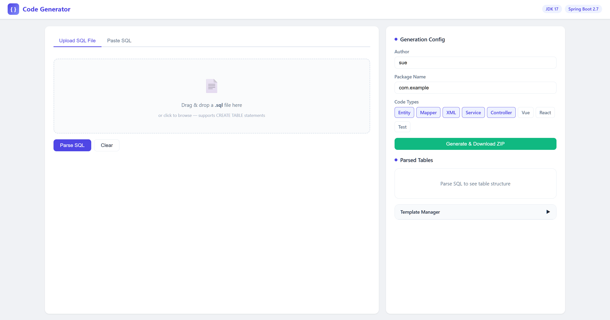

# Code Generator — Admin 后台管理代码生成器

一个自包含的 Web 应用，上传 SQL 建表语句即可自动生成 Admin 后台 CRUD 全套代码。
面向 **管理系统、运营后台、内部工具** 等 B 端场景，不支持面向 C 端用户的业务代码生成。



---

## 快速开始

### 环境要求

- JDK 8+（推荐 JDK 17）
- Maven 3.6+

### 启动项目

```bash
# 1. 编译打包
mvn clean package -DskipTests

# 2. 启动
java -jar target/code-generator-exec.jar
```

浏览器打开：**http://localhost:7000**

### 修改端口

编辑 `src/main/resources/application.yml`：

```yaml
server:
  port: 7000   # 改成你想要的端口
```

---

## 使用指南

### 方式一：上传 SQL 文件

1. 打开页面，默认在 **Upload SQL File** 标签页
2. 点击上传区域或将 `.sql` 文件拖拽到虚线框内
3. 文件内容会自动加载并解析
4. 右侧面板展示解析出的**表名、字段、类型映射**

### 方式二：粘贴 SQL

1. 切换到 **Paste SQL** 标签页
2. 在编辑器中粘贴 CREATE TABLE 语句
3. 点击 **Parse SQL** 按钮（或按 `Ctrl + Enter`）

支持的 SQL 示例：

```sql
CREATE TABLE `user` (
  `id` bigint NOT NULL AUTO_INCREMENT COMMENT '用户ID',
  `username` varchar(50) NOT NULL COMMENT '用户名',
  `email` varchar(100) DEFAULT NULL COMMENT '邮箱',
  `age` int DEFAULT 0 COMMENT '年龄',
  `create_time` datetime DEFAULT CURRENT_TIMESTAMP COMMENT '创建时间',
  PRIMARY KEY (`id`)
) ENGINE=InnoDB DEFAULT CHARSET=utf8mb4 COMMENT='用户表';
```

> 支持同时包含多条 CREATE TABLE 语句（用分号分隔），一次性生成多表代码。

### 配置生成参数

右侧面板可配置：

| 参数 | 说明 | 默认值 |
|------|------|--------|
| **Author** | 代码注释中的作者名 | `sue` |
| **Package Name** | Java 包名 | `com.example` |
| **Code Types** | 选择要生成的代码类型 | Entity/Mapper/XML/Service/Controller |

支持的代码类型：

| 类型 | 生成文件 | 适配脚手架 |
|------|----------|------------|
| Entity | `XxxEntity.java` + `XxxConditionEntity.java` | — |
| Mapper | `XxxMapper.java` | — |
| XML | `XxxMapper.xml` | — |
| Service | `XxxService.java` | — |
| Controller | `XxxController.java` | — |
| Vue | `api.js` + `index.vue` | [vue-element-admin](https://github.com/PanJiaChen/vue-element-admin) |
| React | `api.ts` + `index.tsx` | [Ant Design Pro](https://github.com/ant-design/ant-design-pro) |
| Test | `XxxMapperTest.java` + `XxxServiceTest.java` + `XxxControllerTest.java` | — |

### 生成并下载

1. 确认 SQL 已解析（右侧显示表信息）
2. 勾选需要的代码类型
3. 点击 **Generate & Download ZIP** 按钮
4. 浏览器自动下载 `code-generator.zip`

---

## 模板管理

展开页面底部的 **Template Manager** 面板：

- **查看模板** — 点击模板文件名加载内容到编辑器
- **编辑模板** — 修改后点 Save 保存为用户自定义模板
- **校验语法** — 点 Validate 检查 Velocity 模板语法是否正确
- **还原默认** — 点 Restore Defaults 备份并删除所有自定义模板（会下载备份 ZIP）

自定义模板保存在 `~/.code-generator/templates/` 目录下，优先级高于默认模板。

---

## API 接口

> 所有接口前缀：`/api/gen`

### 上传并解析 SQL 文件

```http
POST /api/gen/upload
Content-Type: multipart/form-data

file: your_ddl.sql
```

### 解析 SQL 文本

```http
POST /api/gen/parse
Content-Type: application/json

{ "sql": "CREATE TABLE ..." }
```

### 生成代码

```http
POST /api/gen/generate
Content-Type: application/json

{
  "author": "sue",
  "packageName": "com.example",
  "createSql": "CREATE TABLE ...",
  "codeTypes": ["entity", "mapper", "xml", "service", "controller"]
}
```

响应为 ZIP 文件流。

### 模板相关

| 方法 | 路径 | 说明 |
|------|------|------|
| GET | `/api/gen/templates` | 获取模板列表 |
| GET | `/api/gen/template?name=Entity.java.vm` | 获取模板内容 |
| POST | `/api/gen/template` | 保存自定义模板 |
| POST | `/api/gen/template/validate` | 校验模板语法 |
| GET | `/api/gen/template/custom?name=Entity.java.vm` | 检查是否存在自定义模板 |
| POST | `/api/gen/templates/restore` | 还原默认模板（下载备份ZIP） |

---

## 项目结构

```
code-generator/
├── pom.xml
├── src/main/java/cn/net/susan/generate/
│   ├── Application.java                   # 启动入口
│   ├── config/
│   │   ├── GenConfig.java                 # 生成器配置
│   │   └── YamlPropertySourceFactory.java # YAML 配置加载
│   ├── controller/
│   │   ├── GenController.java             # REST API 控制器
│   │   └── PageController.java            # 首页路由
│   ├── domain/                            # 数据对象
│   │   ├── BaseEntity.java
│   │   ├── ColumnConfigInfo.java
│   │   ├── ColumnInfo.java
│   │   ├── GenResult.java
│   │   ├── SqlGenRequest.java
│   │   ├── TableInfo.java
│   │   └── TemplateRequest.java
│   ├── service/
│   │   ├── IGenService.java
│   │   └── impl/GenServiceImpl.java       # 代码生成核心逻辑
│   └── util/
│       ├── CharsetKit.java
│       ├── Convert.java
│       ├── GenUtils.java                  # 模板/类型/文件名工具
│       ├── SqlParser.java                 # CREATE TABLE 解析器
│       ├── StrFormatter.java
│       ├── StringUtil.java
│       └── VelocityInitializer.java       # Velocity 引擎初始化
├── src/main/resources/
│   ├── application.yml                    # Spring Boot 配置
│   ├── generator.yml                      # 代码生成默认参数
│   ├── static/index.html                  # Web UI（自包含 SPA）
│   └── vm/                                # Velocity 模板
│       ├── java/
│       │   ├── ConditionEntity.java.vm
│       │   ├── Controller.java.vm
│       │   ├── ControllerTest.java.vm
│       │   ├── Entity.java.vm
│       │   ├── Mapper.java.vm
│       │   ├── MapperTest.java.vm
│       │   ├── Service.java.vm
│       │   └── ServiceTest.java.vm
│       ├── test/pom-dependencies.xml.vm
│       ├── vue/
│       │   ├── api.js.vm
│       │   └── index.vue.vm
│       ├── react/
│       │   ├── api.ts.vm
│       │   └── index.tsx.vm
│       └── xml/Mapper.xml.vm
```

---

## 设计思路

### 整体架构

```
 ┌──────────┐    ┌──────────────┐    ┌──────────────┐    ┌──────────────┐
 │ SQL 输入  │ →  │  SqlParser   │ →  │  Velocity    │ →  │  ZIP 输出    │
 │ (文件/粘贴)│    │  解析为 Table │    │  模板渲染     │    │  (完整项目)  │
 └──────────┘    └──────────────┘    └──────────────┘    └──────────────┘
```

整个代码生成器由四个核心环节组成，以 **流水线** 的方式串联。

### 1. SQL 解析 → TableInfo

`SqlParser` 用正则表达式解析 `CREATE TABLE` 语句，提取：

- **表名** — 通过 `GenUtils.tableToJava()` 转为 UpperCamelCase 的 `className`
- **表注释** — 去掉"表/信息/管理"等冗余词，作为页面标题
- **字段列表** — 每个字段拆出：列名、数据类型、注释、是否自增

解析后对每个字段调用 `GenUtils.transColums()` 做二次加工：

| 加工步骤 | 示例 |
|----------|------|
| 列名转 camelCase | `create_time` → `createTime` / `CreateTime` |
| SQL 类型映射 Java 类型 | `varchar` → `String`，`bigint` → `Long` |
| 标记主键 | 自增字段自动设为主键 |

最终得到 `TableInfo`（含 `className`、`primaryKey`、`ColumnInfo[]`），作为后续模板渲染的**唯一数据来源**。

### 2. Velocity 上下文构建

`GenUtils.getVelocityContext()` 将 `TableInfo` 展开为模板变量：

| 变量 | 含义 | 示例 |
|------|------|------|
| `${className}` | 大驼峰类名 | `User` |
| `${classname}` | 小驼峰类名 | `user` |
| `${tableName}` | 原始表名 | `user` |
| `${tableComment}` | 表注释 | `用户` |
| `${primaryKey}` | 主键字段名 | `id` |
| `${columns}` | 字段列表 | 可迭代 `#foreach` |
| `${package}` | 包名 | `com.example` |
| `${moduleName}` | 模块名（包名最后一段） | `example` |
| `${author}` | 作者 | `sue` |
| `${datetime}` | 生成时间 | `2025-01-01 12:00:00` |

模板通过 Velocity 的 `#foreach`、`#if` 等指令遍历列、过滤审计字段，生成最终代码。

### 3. 模板组织与分发

模板按**输出目标**分目录存放：

```
vm/
├── java/       → Java 代码（Entity, Mapper, Service, Controller, Tests）
├── xml/        → MyBatis XML 映射文件
├── vue/        → Vue 2 + Element UI（vue-element-admin 脚手架）
└── react/      → React + TypeScript + Ant Design Pro（ProTable / ModalForm）
```

每套模板是一个**独立、可替换的产出单元**。勾选不同 Code Type，后端通过 `filterTemplatesByCodeTypes()` 筛选对应的 `.vm` 模板进行渲染，不勾选的模板完全不参与渲染。

Code Type → 模板映射关系：

```
entity      → Entity.java.vm, ConditionEntity.java.vm
mapper      → Mapper.java.vm
xml         → Mapper.xml.vm
service     → Service.java.vm
controller  → Controller.java.vm
vue         → api.js.vm, index.vue.vm
react       → api.ts.vm, index.tsx.vm
test        → MapperTest.java.vm, ServiceTest.java.vm, ControllerTest.java.vm
```

### 4. 文件命名与 ZIP 打包

`GenUtils.getFileName()` 根据模板名称推导输出路径。关键逻辑：

- **Java 类名** — 从模板内容正则提取 `class ${className}XXX` 中的后缀（如 `Entity`、`Mapper`），拼出完整文件名
- **包路径** — 从模板内容正则提取 `package ${package}.xxx` 中的子包名，拼出目录结构
- **前端文件** — 直接用固定规则：`api.js` → `templates/{classname}/api.js`

所有文件写入 `ZipOutputStream`，在内存中构建 ZIP，直接输出为 HTTP 响应流——不落盘。

### 5. 自定义模板覆盖机制

用户通过 UI 编辑模板后，内容保存到 `~/.code-generator/templates/` 目录。渲染时优先使用该目录下的同名文件：

```
classpath:vm/java/Entity.java.vm  (默认)
          ↓ 用户保存后
~/.code-generator/templates/Entity.java.vm  (优先)
```

由 `GenConfig.ignoreCustomTemplate` 控制开关，默认关闭（忽略自定义）。还原时会将自定义模板打包为 ZIP 下载后删除。

### 6. 前端框架扩展方式

要新增一个前端框架（如本次的 React），只需三步：

1. **新增模板** — 在 `vm/{framework}/` 下放置 `.vm` 模板文件
2. **注册模板** — 在 `GenUtils.getTemplates()` 添加路径，在 `getFileName()` 添加命名规则
3. **注册 Code Type** — 在 `GenServiceImpl.filterTemplatesByCodeTypes()` 添加映射，在 `index.html` 添加复选框

整个过程不涉及任何 SQL 解析、类型映射、ZIP 打包的改动，因为这些环节是**框架无关**的。模板只消费 `VelocityContext` 里的变量，前端框架之间的差异完全隔离在模板文件内部。

---

## 类型映射

SQL 类型到 Java 类型的默认映射：

| SQL 类型 | Java 类型 |
|----------|-----------|
| tinyint / smallint / int / integer | `Integer` |
| bigint | `Long` |
| float | `Float` |
| double | `Double` |
| decimal | `BigDecimal` |
| bit | `Boolean` |
| char / varchar / text / longtext | `String` |
| date / datetime / timestamp / time | `Date` |

---

## 表设计规范

生成器为 **Admin 管理后台** 场景设计，模板对表结构有一组约定字段。建表时需包含以下系统列，否则生成的 XML 中硬编码的字段引用会报错。

### 必需字段

| 字段 | 推荐类型 | 默认值 | 说明 |
|------|----------|--------|------|
| `id` | `bigint` | AUTO_INCREMENT | 主键，自增 |
| `is_del` | `tinyint` | `0` | 软删除标记：0=正常，1=已删除 |
| `create_time` | `datetime` | CURRENT_TIMESTAMP | 创建时间，由数据库自动填充 |
| `create_user_id` | `bigint` | — | 创建人 ID，由 `FillUserUtil` 在插入时自动填充 |
| `create_user_name` | `varchar(50)` | — | 创建人名称，由 `FillUserUtil` 在插入时自动填充 |
| `update_time` | `datetime` | CURRENT_TIMESTAMP ON UPDATE | 更新时间，`update` 时设置为 `now(3)`，同时作为乐观锁版本号 |
| `update_user_id` | `bigint` | — | 更新人 ID，由 `FillUserUtil` 在更新时自动填充 |
| `update_user_name` | `varchar(50)` | — | 更新人名称，由 `FillUserUtil` 在更新时自动填充 |

### 标准建表 SQL 示例

```sql
CREATE TABLE `user` (
  `id` bigint NOT NULL AUTO_INCREMENT COMMENT '用户ID',
  `username` varchar(50) NOT NULL COMMENT '用户名',
  `email` varchar(100) DEFAULT NULL COMMENT '邮箱',
  `is_del` tinyint NOT NULL DEFAULT 0 COMMENT '删除标记(0:正常 1:已删除)',
  `create_time` datetime DEFAULT CURRENT_TIMESTAMP COMMENT '创建时间',
  `create_user_id` bigint DEFAULT NULL COMMENT '创建人ID',
  `create_user_name` varchar(50) DEFAULT NULL COMMENT '创建人名称',
  `update_time` datetime DEFAULT CURRENT_TIMESTAMP ON UPDATE CURRENT_TIMESTAMP COMMENT '更新时间',
  `update_user_id` bigint DEFAULT NULL COMMENT '更新人ID',
  `update_user_name` varchar(50) DEFAULT NULL COMMENT '更新人名称',
  PRIMARY KEY (`id`),
  KEY `idx_is_del` (`is_del`)
) ENGINE=InnoDB DEFAULT CHARSET=utf8mb4 COMMENT='用户表';
```

### 字段行为说明

**审计字段（不在 Entity 中生成）**

`id`、`is_del`、`create_time`、`create_user_id`、`create_user_name`、`update_user_id`、`update_user_name` 这几个字段被 Entity 模板自动过滤，不会出现在生成的 `XxxEntity.java` 中。它们的值由框架层统一管理：

- `create_time` — 数据库 `DEFAULT CURRENT_TIMESTAMP` 自动填充
- `create_user_id` / `create_user_name` — `FillUserUtil.fillInsertUserInfo()` 在 Service.insert() 中自动注入
- `update_user_id` / `update_user_name` — `FillUserUtil.fillUpdateUserInfo()` 在 Service.update() / deleteByIds() 中自动注入
- `is_del` — 所有查询自动带 `AND is_del = 0`，删除操作走逻辑删除（`SET is_del = 1`）

**`update_time` 特殊处理**

`update_time` 是唯一一个在 Entity 中保留的系统字段。它承担双重职责：

1. **自动更新时间戳** — `update` / `delete` 语句硬编码 `update_time = now(3)`
2. **乐观锁版本号** — `update` 语句的 WHERE 子句包含 `AND update_time = #{updateTime}`，防止并发覆盖

> 如果你不需要乐观锁且 Entity 中有 `updateTime` 让你困扰，可以自行在 Entity.java.vm 中将 `updateTime` 加回过滤列表。

### 软删除机制

整个模板统一使用 **逻辑删除** 策略：

| 操作 | 软删除行为 |
|------|-----------|
| `findById` / `findByIds` | WHERE 带 `AND is_del = 0` |
| `searchByCondition` / `searchCount` | queryWhere 末尾固定 `AND is_del = 0` |
| `update` | WHERE 带 `AND is_del = 0`，禁止修改已删除记录 |
| `deleteByIds` | 不执行 DELETE，改为 `UPDATE SET is_del = 1`，且带 `WHERE is_del = 0` 防止重复删除 |

### 乐观锁机制

`update` 语句利用 `update_time` 字段实现乐观锁，防止并发更新丢失：

```sql
-- 生成的 update 语句
UPDATE user SET username = #{username}, update_time = now(3)
WHERE id = #{id} AND is_del = 0 AND update_time = #{updateTime}
```

- 实体从数据库加载时带有当前的 `updateTime`
- 提交更新时，WHERE 中校验 `update_time` 是否未被他人修改
- 若 `update_time` 已变化（被其他事务修改），WHERE 不命中，返回 affected rows = 0
- Service 层检测到 0 行更新后应抛出并发修改异常（需自行在 Service.update() 中添加该检查）

---

## 生成的增删改查方法

以下列出勾选 Service / Controller / Mapper / XML 后，生成代码中实际包含的全部方法。

### Service（`XxxService.java`）

| 方法签名 | 说明 |
|----------|------|
| `XxxEntity findById(Long id)` | 根据主键 ID 查询单条记录 |
| `ResponsePageEntity<XxxEntity> searchByPage(XxxConditionEntity condition)` | 条件分页查询，自动统计总数，count=0 返回空页 |
| `int insert(XxxEntity entity)` | 新增记录，带 `@Transactional` 事务 |
| `int update(XxxEntity entity)` | 修改记录，带 `@Transactional` 事务 |
| `int deleteByIds(List<Long> ids)` | 批量逻辑删除（`is_del = 1`），删除前校验记录存在 |
| `BaseMapper getBaseMapper()` | 返回 Mapper 实例，供父类 `BaseService` 通用方法使用 |

### Controller（`XxxController.java`）

| HTTP 方法 | 路径 | 说明 |
|-----------|------|------|
| `GET` | `/v1/{classname}/findById?id=` | 根据 ID 查询单条 |
| `POST` | `/v1/{classname}/searchByPage` | 条件分页查询，`@RequestBody` 接收条件实体 |
| `POST` | `/v1/{classname}/insert` | 新增记录 |
| `POST` | `/v1/{classname}/update` | 修改记录 |
| `POST` | `/v1/{classname}/deleteByIds` | 批量删除，接收 `List<Long>` |

> 所有接口带 Swagger `@Api` / `@ApiOperation` 注解，参数校验使用 `@NotNull` / `@Validated`。

### Mapper（`XxxMapper.java`）

| 方法签名 | 说明 |
|----------|------|
| `XxxEntity findById(Long id)` | 根据主键查询单条 |
| `int insert(XxxEntity entity)` | 新增记录 |
| `int update(XxxEntity entity)` | 修改记录 |
| `int deleteByIds(@Param("ids") List<Long> ids, @Param("entity") XxxEntity entity)` | 批量逻辑删除 |
| `List<XxxEntity> findByIds(List<Long> ids)` | 根据 ID 集合批量查询 |
| *(继承自 BaseMapper)* `List<XxxEntity> searchByCondition(XxxConditionEntity condition)` | 条件查询（含分页参数） |
| *(继承自 BaseMapper)* `int searchCount(XxxConditionEntity condition)` | 条件统计总数 |

### XML（`XxxMapper.xml`）

| SQL 片段 / 语句 | 说明 |
|-----------------|------|
| `resultMap` — `XxxResult` | 字段 → 属性的映射，遍历所有列生成 `<result>` |
| `sql` — `selectXxxColumn` | 查询列清单（逗号分隔），供各 SELECT 复用 |
| `sql` — `queryWhere` | 动态 WHERE 条件：遍历所有字段判空生成 `AND col = #{val}`，末尾固定 `AND is_del = 0` |
| `sql` — `paginationSql` | 分页片段：`LIMIT #{pageBegin}, #{pageSize}`，仅当 `pageSize > 0` 时追加 |
| `select` — `findById` | `SELECT ... FROM table WHERE id = #{id} AND is_del = 0` |
| `select` — `searchByCondition` | `SELECT ... FROM table` + queryWhere + paginationSql |
| `select` — `searchCount` | `SELECT COUNT(*) FROM table` + queryWhere |
| `select` — `findByIds` | `SELECT ... FROM table WHERE is_del = 0 AND id IN (...)` |
| `insert` | `INSERT INTO table (...) VALUES (...)` — 动态 `<if>` 判空，自增主键自动跳过 |
| `update` | `UPDATE table SET col=#{val}, update_time=now(3) WHERE id = #{id} AND is_del = 0 AND update_time = #{updateTime}` — 含乐观锁 |
| `delete` — `deleteByIds` | `UPDATE table SET is_del=1, update_time=now(3), ... WHERE is_del = 0 AND id IN (...)` — 逻辑删除，防止重复删除 |

### 关键行为说明

- **分页机制**：分页参数由 `ConditionEntity` 父类统一携带（`pageNum`、`pageSize`、`pageBegin`），XML 中通过 `paginationSql` 自动追加 LIMIT。
- **逻辑删除**：delete 操作不走 `DELETE FROM`，而是 `UPDATE ... SET is_del = 1`，同时自动填充 `update_time` 和 `update_user_id/name`。WHERE 中带 `is_del = 0` 防止重复删除。
- **软删除过滤**：所有查询和更新操作均带 `is_del = 0` 条件，防止越权操作已删除数据。`findById`、`findByIds`、`update`、`deleteByIds` 均覆盖。
- **乐观锁**：`update` 语句的 WHERE 子句包含 `AND update_time = #{updateTime}`。实体从数据库加载时携带当前 `update_time`，提交更新时校验该值未被他人修改。若 0 行更新，需在 Service 层抛并发修改异常。
- **条件查询**：XML 的 `queryWhere` 遍历所有列生成等值匹配条件，且会在末尾固定拼接 `AND is_del = 0` 过滤已删除数据。
- **审计字段**：`insert` 时自动填充 `create_time`、`create_user_id` 等字段（依赖 `FillUserUtil`），`update` 时自动设 `update_time=now(3)`。

---

## 生成后还需自己补充什么

代码生成器产出的是标准 CRUD 骨架，以下列出实际开发中通常需要手动扩展的部分。

### Service 层

| 需补充内容 | 说明 |
|------------|------|
| 业务校验逻辑 | 生成代码只做存在性校验，字段唯一性、状态机流转、业务规则校验需自己加 |
| 批量新增 | 模板只生成单条 `insert()`，如需一次插入多条需自行添加 `batchInsert()` |
| 乐观锁异常处理 | XML 已生成 `WHERE ... AND update_time = #{updateTime}`，但 Service.update() 未检查返回行数。需自行添加：`if (rows == 0) throw new OptimisticLockException("数据已被他人修改")` |
| 缓存注解 | 按需添加 `@Cacheable` / `@CacheEvict`，生成代码不含缓存 |
| 自定义查询方法 | 比如"根据用户名+状态联合查询"、"查询某时间段内的记录"，需在 Service/Mapper/XML 三处联动添加 |
| 导出功能 | 如需 Excel/CSV 导出，需自行在 Service 中实现查询+转换逻辑 |
| 异常与错误码 | 生成代码只抛 `AssertUtil` 的通用异常，业务错误码体系需自行建立 |

### Controller 层

| 需补充内容 | 说明 |
|------------|------|
| 权限控制注解 | 如 `@PreAuthorize("@ss.hasPermi('xxx')")` 或 Shiro `@RequiresPermissions`，生成代码完全没有 |
| 参数校验注解 | `@Valid` / `@Validated` + Entity 上的 `@NotNull` / `@NotBlank` 等需自己加 |
| 导出/下载接口 | 文件下载端点需自行添加 |
| 自定义查询接口 | 除 `searchByPage` 外，需列表/下拉选择/统计等接口自行追加 |
| 接口限流/防重 | 按需加 `@RepeatSubmit`、`@RateLimiter` 等 |

### Mapper 接口

| 需补充内容 | 说明 |
|------------|------|
| 自定义查询方法 | 生成的 5 个方法只覆盖单表 CRUD，联表查询、聚合统计、复杂条件需自己声明 |
| 批量操作 | `batchInsert()` / `batchUpdate()` 等需自行添加 |
| 物理删除 | 生成代码统一走逻辑删除（`is_del=1`），如需真正 `DELETE FROM` 需自己写 |

### XML 映射文件

| 需补充内容 | 说明 |
|------------|------|
| `<sql>` 片段扩展 | 生成的 `queryWhere` 只做等值匹配（`=`），以下条件需自行扩展： |
|  | • **模糊匹配**：`AND name LIKE CONCAT('%', #{name}, '%')` |
|  | • **范围查询**：`AND create_time >= #{beginTime} AND create_time <= #{endTime}` |
|  | • **IN 查询**：`AND status IN <foreach ...>` |
|  | • **IS NULL / IS NOT NULL** |
|  | • **OR 条件**：生成的全是 `AND` |
| 排序 (ORDER BY) | 生成代码不含排序，需自行添加 `<sql>` 片段或前端传参动态排序 |
| 联表查询 | 新增 `<resultMap>` + `<select>` 处理 JOIN |
| 聚合查询 | `GROUP BY` + `SUM` / `COUNT` / `AVG` 等均需手写 |
| 批量 INSERT | 遍历集合的批量插入语句需自行添加 |

### Entity 实体

| 需补充内容 | 说明 |
|------------|------|
| 校验注解 | Entity 字段上无 `@NotNull` / `@NotBlank` / `@Size` 等，需按业务自行添加 |
| 枚举字段 | 数据库存 `int` / `varchar` 的枚举列，Java 侧建议改为 `Enum` 类型，生成的是原始类型 |
| 冗余/展示字段 | 只生成表字段，前端展示用的关联对象名、状态文本等需自行加 `@Transient` 字段 |
| 日期格式化 | 如需特定格式输出，加 `@JsonFormat(pattern = "yyyy-MM-dd HH:mm:ss")` |

### ConditionEntity 查询条件

| 需补充内容 | 说明 |
|------------|------|
| 非等值匹配字段 | 生成的全部是等值匹配字段，如需模糊查询需加 `String nameLike`，范围查询需加 `Date createTimeStart` / `Date createTimeEnd` 等 |
| 排序参数 | 如需前端控制排序字段和方向，加 `orderBy` / `isAsc` 等属性 |

> **适用边界**：本生成器专为 **Admin 管理后台** 设计，假设每张表都走标准 CRUD + 软删除 + 审计字段模式。你的表越多、越"标准"，收益越大。**不适合的场景**：面向 C 端的高并发接口、复杂业务工作流、非 CRUD 的领域服务、无审计字段的轻量表。这些场景下模板假设不成立，生成的代码反而会成为负担。

---

## 常见问题

**Q: 支持哪些数据库的 SQL 语法？**

支持 MySQL / MariaDB 的 CREATE TABLE 语法。其他数据库的 DDL 如结构与 MySQL 接近通常也能解析。

**Q: 自定义模板不生效？**

检查 `generator.yml` 中 `gen.ignoreCustomTemplate` 是否为 `false`。默认为 `true`（忽略自定义模板）。

**Q: 能否用于面向 C 端用户的业务？**

不建议。本工具为 Admin 管理后台场景设计，模板内置了大量 B 端假设：

- 每表固定 8 个审计字段（`is_del` / `create_time` / `update_time` / `create_user_id` 等）
- 所有删除走逻辑删除（`is_del = 1`），不生成物理 DELETE
- 查询条件仅支持等值匹配（`col = #{val}`），不含 LIKE / BETWEEN / 聚合
- 无缓存、无读写分离、无事件驱动相关代码

C 端业务的 Schema 设计、查询模式、性能策略与 Admin 后台完全不同，强行套用模板会导致大量返工。C 端场景建议手写或使用 AI 辅助生成。

**Q: 如何修改生成的包名和作者默认值？**

编辑 `src/main/resources/generator.yml`：

```yaml
gen:
  author: 你的名字
  packageName: com.yourcompany
```
